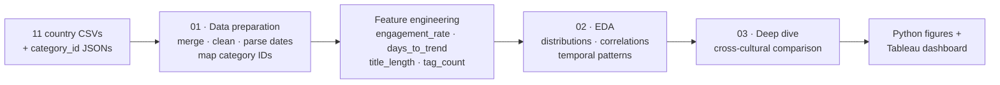
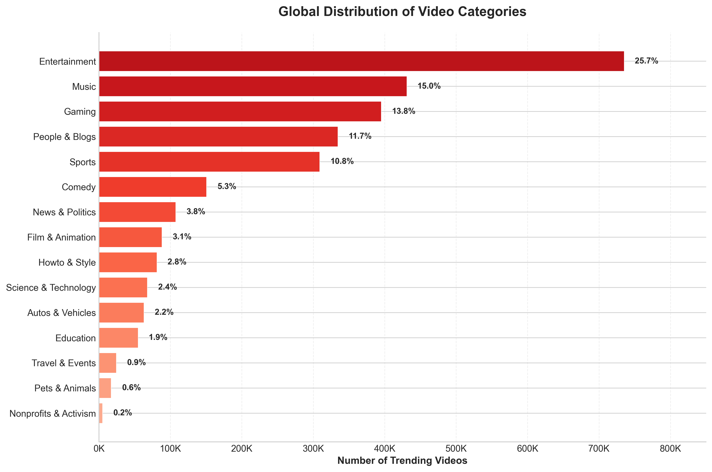
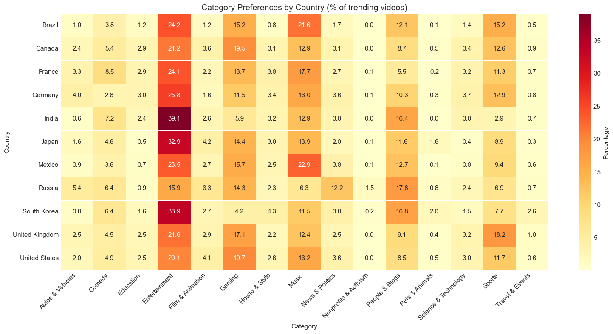
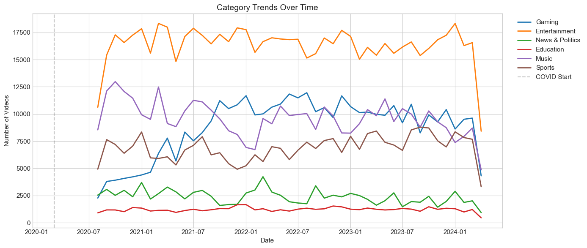

# 🎬 YouTube Trending Video Analysis

**What makes a video trend — and why does it differ so sharply from country to country?** A cross-cultural analysis of **2.87 million** trending records across **11 countries** (Aug 2020 – Apr 2024), turning raw trending data into cultural fingerprints, engagement patterns, and an interactive Tableau dashboard.

> YZV475E — Data Visualization, Term Project · Team EnAi · Istanbul Technical University
> Muhammed Abdullah Özdemir · Hikmet Gültekin

## Pipeline



## Key findings

**1. Cultural fingerprints** — every country trends differently:
- 🇮🇳 India: 39.1% Entertainment
- 🇧🇷 Brazil / 🇲🇽 Mexico: 21%+ Music
- 🇷🇺 Russia: 12.2% News & Politics (≈4× the global average)
- 🇺🇸 USA: 19.7% Gaming

**2. K-Pop dominance** — the top 4 channels by trending frequency are all K-Pop labels:

| Channel | Trending appearances |
|---|--:|
| HYBE LABELS (BTS) | 6,992 |
| BANGTANTV | 6,426 |
| JYP Entertainment | 6,399 |
| SMTOWN | 6,146 |

**3. Engagement paradox** — Brazil (8%) and Mexico (7%) show the highest engagement, Japan and South Korea the lowest (3%), yet Asian content still travels globally.

## Figures

| Category distribution | Country × category heatmap | Trend over time |
|---|---|---|
|  |  |  |

## Dataset

| Metric | Value |
|--------|-------|
| Total records | 2,865,397 |
| Unique videos | 488,876 |
| Unique channels | 49,217 |
| Countries | 11 |
| Time range | Aug 2020 – Apr 2024 |

**Countries:** US, GB, CA, DE, FR, BR, MX, RU, JP, KR, IN. Source: [Kaggle — YouTube Trending Video Dataset](https://www.kaggle.com/rsrishav/youtube-trending-video-dataset).

## Methodology

1. **Data collection** — merge 11 country CSV files.
2. **Cleaning** — handle missing values, parse dates, map category IDs (JSONs in `input/`).
3. **Feature engineering:**
   - `engagement_rate = (likes + comments) / views × 100`
   - `days_to_trend = trending_date − published_date`
   - `title_length`, `tag_count`
4. **Analysis** — correlation, temporal patterns, cross-cultural comparison.
5. **Visualization** — Python (matplotlib/seaborn) figures + an interactive Tableau dashboard.

## Dashboard

An interactive Tableau dashboard accompanies the analysis: choropleth world map, category distribution, trend-over-time, country–category heatmap, engagement by country, and top-10 channels, with cross-filtering and country / category / date-range filters. *(Built in Tableau; the `.twbx` workbook is not committed here — see the figures above for static exports.)*

## Quick start

```bash
git clone https://github.com/muhammedabdullahozdemirr/youtube-trending-analysis.git
cd youtube-trending-analysis
pip install -r requirements.txt
```

Download the dataset ([Google Drive](https://drive.google.com/drive/folders/1fne-OR6AuPrvyVYgFAolPmlXcoF-btE2?usp=drive_link) or Kaggle) and place the country CSVs under `input/youtube-trending-video-dataset/`, then run the notebooks in order:

```bash
jupyter notebook   # run 01 → 02 → 03
```

## Project structure

```
.
├── notebooks/
│   ├── 01_data_preparation.ipynb   # cleaning & merging
│   ├── 02_eda.ipynb                # exploratory data analysis
│   └── 03_deep_dive_analysis.ipynb # cross-cultural deep dive
├── input/youtube-trending-video-dataset/
│   └── *_category_id.json          # per-country category maps (CSVs gitignored)
├── output/figures/
│   ├── figure1_category_distribution.png
│   ├── figure2_heatmap.png
│   └── figure3_timeseries.png
├── requirements.txt
└── README.md
```

## License

MIT — free to use for educational purposes.
